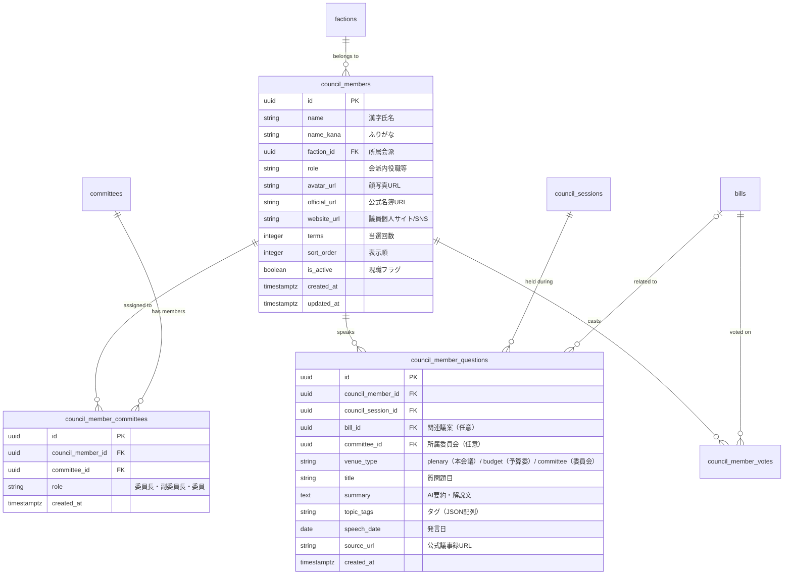

# 議員ページ（Council Person Page）要件定義・設計（世田谷モデル）

## 1. 背景と目的

「みらい議会＠世田谷区」（civictech-setagaya.org）では、区議会議員ごとの活動・発言・質問内容を整理し、区民が身近な議員の関心分野や活動実績を一覧できる「議員ページ」（`/councilors` および `/councilors/[id]`）が提供されている。

本ドキュメントは、「みらい議会＠新宿区」において、世田谷モデルを参考に新宿区議会議員（定数38名）の一覧および個別詳細ページを導入するための機能要件、データモデル、UI/UX方針、および段階的実装計画を定義する。

---

## 2. 世田谷モデル（みらい議会＠世田谷区）の調査分析

実サイト（`civictech-setagaya.org/councilors` および `/councilors/[id]`）の構成要素：

### 2.1 議員一覧（`/councilors`）
1. **全体サマリー指標**:
   - 掲載議員数（例: 50人）
   - 質問がある議員数
   - 掲載中の質問総数（例: 1381件）
   - 区分別質問数（議会・本会議、予算委員会、所属委員会）
2. **議員カード一覧**:
   - 顔写真アバター（円形、グラデーション枠）
   - 議員氏名（ひらがな/漢字）
   - 質問総数バッジ（例: `質問 30件`）
   - 会場別質問内訳バッジ（`議会 9件` / `予算委 10件` / `委員会 11件`）
   - 詳細リンクアイコン（右矢印）

### 2.2 議員詳細（`/councilors/[id]`）
1. **パンくず・戻る導線**:
   - `← 議員一覧へ`
2. **議員ヘッダーカード**:
   - 自治体議員表記（`世田谷区議会議員`）
   - 議員氏名（大きく見出し表示）
   - 顔写真
   - 質問件数サマリーバッジ群
3. **「この議員について」セクション**:
   - **会派等**: 所属会派名（例: レインボー世田谷）＋ 自治体公式名簿への外部リンク（基準日付き）
   - **所属委員会**: 常任委員会、特別委員会、役職（委員長・副委員長・委員）＋ 公式名簿リンク
   - **掲載中の質問からの傾向サマリー**:
     - 主なテーマタグ（例: 「教育」「行財政」「防災」）
     - AIによる質問傾向の要約解説文（一次資料に基づき中立に要約）
     - データ算出根拠・基準日表記（例: `このサイトで公開中の質問25件をもとに整理（2026年8月29日現在）`）
4. **「掲載中の質問」セクション**:
   - 質問カードの時系列リスト:
     - 質問テーマ・件名
     - 発言日
     - リンク先導線（「議会での質問へ」「所属委員会の質問へ」「議案詳細へ」）
     - 質問要約ブロック（引用符アイコン、議員アバター、発言要約テキスト）

---

## 3. 新宿区議会における機能要件

### 3.1 新宿区議会の基本情報
- **定数**: 38名
- **主な会派**:
  - 新宿区議会自由民主党
  - 新宿区議会公明党
  - 日本維新の会新宿区議会議員団
  - 日本共産党新宿区議会議員団
  - 立憲民主党・無所属クラブ
  - 新宿区議会れいわ新選組 等
- **公式一次資料**:
  - 新宿区議会公式サイト 議員名簿（会派別・期別・委員会別）
  - 本会議・委員会会議録検索システム
  - 定例会・臨時会の議決結果・賛否一覧

### 3.2 要件一覧

| ID | 画面/機能 | 要件内容 | 優先度 |
|---|---|---|---|
| REQ-1 | 議員一覧画面 | `/councilors` にて新宿区議会議員（38名）のカード一覧を表示する | Phase 7-A |
| REQ-2 | 会派・委員会フィルタ | 会派別・委員会別のフィルタリング・グルーピングができる | Phase 7-A |
| REQ-3 | 議員詳細画面 | `/councilors/[id]` にて議員プロフィール、所属会派、所属委員会を表示する | Phase 7-A |
| REQ-4 | 公式資料リンク | 議員情報ごとに新宿区議会公式名簿ページへの外部リンク（基準日明記）を設置する | Phase 7-A |
| REQ-5 | 発言・質問一覧 | 議員詳細画面で、定例会・委員会での発言・質問の要約カードを表示する | Phase 7-B |
| REQ-6 | 関心テーマ要約 | AIが発言記録から主な関心テーマと活動サマリーを中立に抽出・要約する | Phase 7-B |
| REQ-7 | 議案・賛否連携 | 議案詳細ページから当該議案に賛否を示した/質問した議員への相互リンクを設ける | Phase 7-C |
| REQ-8 | 免責・出典明示 | 非公式シビックテックサービスとしての免責事項、要約の生成元となった公式議事録URLを明示する | 共通・必須 |

---

## 4. UI/UX・デザインシステム要件

プロジェクトのデザインシステム **Organic**（`docs/20260917_1800_デザインシステム定義.md`）およびアクセシビリティ基準（WCAG 2.2 AA）を厳格に適用する：

1. **カラーパレット**:
   - 背景は `bg-background`（温かいクリーム地 `#f5ead8`）、カード面は `bg-card`（`#ebddc5`）
   - 白（`bg-white`）は原則禁止
   - テキストは `text-mirai-text`、補助テキストは `text-mirai-text-muted`
   - アクセントカラーは `text-mirai-accent-text`（コントラスト比7:1以上を確保）
2. **タイポグラフィ**:
   - 和文見出し: Zen Maru Gothic
   - 和文本文: Zen Kaku Gothic New（16px / 行間1.9）
   - 英数字ラベル: Caprasimo（`font-display`）
3. **コンポーネント**:
   - 直角や細い枠線は作らず、`rounded-xl`（32px）と面の色・影（`shadow-mirai-sm/md`）で区切る
   - ボタン・タグは `rounded-full`
   - ボタンは必ず `@/components/ui/button` の `Button` を使用
   - アイコンは `lucide-react`（stroke-width 2.75）を使用し、インラインSVGは禁止
   - タップ領域はすべて44px以上を確保

---

## 5. データモデル設計案

既存テーブル（`factions`, `committees`）と連携する構成とする。

---

## 6. 実装フェーズ分割

### Phase 7-A: 議員名簿・基本プロフィール（静的・準静的データ）
- **DB**: `council_members`, `council_member_committees` のマイグレーション作成
- **シード**: 新宿区議会38名の基本情報（氏名、ふりがな、会派、委員会、公式名簿URL）
- **Web UI**:
  - `/councilors`: 議員一覧（会派別グループ表示、アバター、氏名、会派バッジ）
  - `/councilors/[id]`: 議員詳細（プロフィール、会派、委員会、公式名簿リンク）
- **ルート登録**: `web/src/lib/routes.ts` への `routes.councilors.list()`, `routes.councilors.detail(id)` 追加およびテスト

### Phase 7-B: 質問・発言要約連携
- **DB**: `council_member_questions` テーブルの追加
- **データ収集**: 令和8年第2回定例会（および過去会期）の一般質問・常任委員会質問の取得と要約
- **Web UI**:
  - 議員詳細画面に「掲載中の質問」リストおよび「主なテーマ」「AIサマリー」を追加
  - 一覧画面に質問件数バッジを追加

### Phase 7-C: 議案賛否連携
- **DB**: `council_member_votes` または会派賛否（`faction_stances`）からの個別議員賛否の展開
- **Web UI**:
  - 議員詳細画面に議案への賛否一覧（原案可決・承認案件等）を表示
  - 議案詳細画面から発言議員・賛否議員への逆リンクを提供
