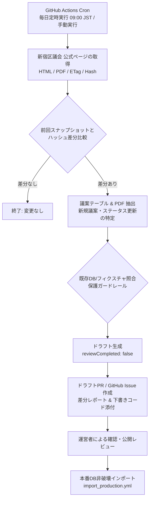

# 設計書: P5-1 自動化 — 新宿区議会更新検知とドラフト生成（Automation: Detection & Draft Generation）

## 1. 概要と受け入れ基準 (Overview & Acceptance)

### バックログ定義 (BACKLOG.md P5-1)
> **Acceptance**:
> new Shinjuku page/PDF change creates draft, never silently overwrites reviewed content.
> （新宿区議会の公式ページまたはPDFの変更を検知してドラフトを生成し、レビュー済みのコンテンツを決して自動で上書きしないこと）

### 目的
新宿区議会の公式ページ（定例会提出議案、議決結果、決議・意見書等）に新たな議案が提出されたり、審議結果・PDFが更新された際、手動での監視負担をなくし、**自動で更新を検知してドラフト（下書き）を生成**する。  
生成されたドラフトは運営者による確認・レビューを経てのみ本番へ反映され、**すでに公開・レビュー済みの解説文や賛否データを誤って破壊・上書きしない安全設計**を保証する。

---

## 2. 全体アーキテクチャ (Architecture Overview)



---

## 3. 監視対象リソース (Monitored Targets)

| 種別 | URL / リソース | 検知対象の変更 |
| :--- | :--- | :--- |
| **定例会提出議案一覧** | `https://www.city.shinjuku.lg.jp/kusei/kuseijoho01_001109_03.html` | 新たな定例会の追加、議案一覧テーブルの行追加、審議状況の更新 |
| **議案の概要と審議結果（PDF）** | 上記ページからリンクされる公式PDF | PDFファイルのハッシュ変更（採決結果・会派賛否の確定） |
| **決議・意見書一覧** | `https://www.city.shinjuku.lg.jp/kusei/kuseijoho01_00001_00017.html` | 議員提出議案（意見書等）の全文PDF追加 |
| **本会議・委員会日程** | 区議会トップ・日程ページ | 次回定例会の開会・閉会日の公表 |

---

## 4. 差分検知エンジン（Change Detection Engine）

### 4.1 スナップショット状態管理 (`packages/seed/data/monitored-state.json`)
リポジトリ内に監視対象の最新状態スナップショットをJSONとして保持：
```json
{
  "lastCheckedAt": "2026-09-25T09:00:00Z",
  "targets": {
    "councilBillsDetailUrl": {
      "url": "https://www.city.shinjuku.lg.jp/kusei/kuseijoho01_001109_03.html",
      "contentHash": "sha256:...",
      "lastModifiedHeader": "Fri, 25 Sep 2026 ...",
      "detectedSessions": ["r8-2", "r8-1"]
    },
    "resultsPdf": {
      "url": "https://www.city.shinjuku.lg.jp/.../000459xxx.pdf",
      "sha256": "dfe433d8..."
    }
  }
}
```

### 4.2 差分判定ステップ
1. **HTTP HEAD / 条件付きGET**:
   - `If-Modified-Since` / `If-None-Match` ヘッダーを活用し、更新がなければ 304 で通信負荷・サーバー負荷を最小化。
2. **HTML DOM 正規化 & ハッシュ比較**:
   - 区の公式サイトの日時表示など動的部分を除外し、議案テーブル（`<table>`）やリンク部分のテキスト・URL の SHA-256 ハッシュを比較。
3. **新規検出アイテムのリストアップ**:
   - 既存の `inventory`（例: `shinjuku-r8-2-inventory.ts`）に存在しない `officialLabel` / `officialTitle` を検出。

---

## 5. ドラフト生成と非破壊・保護ガードレール (Safety Guardrails)

### 5.1 「レビュー済みコンテンツを決して上書きしない」原則
Acceptance Criteria の最重要項目である「never silently overwrites reviewed content」を担保するための厳格なルール：

1. **直接本番DB書き込みの禁止**:
   - 自動検知ジョブはいかなる場合も **本番DBへ直接 `insert` や `update` を実行しない**。
   - 出力は必ず **Git ブランチ（ドラフトファイル）** または **GitHub Issue / PR** の形態をとる。
2. **`reviewCompleted: false` の強制付与**:
   - 自動生成されたドラフト議案はすべて例外なく `reviewCompleted: false` を設定。
   - これにより、DBに反映されても公開画面では「レビュー中」バナーが表示され、人間によるファクトチェックが未了であることが明示される。
3. **既存のレビュー済み解説文（`is_review_completed: true`）の保護**:
   - すでに解説文（やさしい／ふつう／くわしく）が存在しレビュー完了している議案について、公式サイト側で文言微修正があっても、既存の解説文を自動で置換・上書きしない。
   - 変更がある場合は「差分提案（Diff）」としてレポートに記載し、人間が比較して採用可否を判断する。

---

## 6. 運用・通知ワークフロー (Workflow & Notification)

### 6.1 GitHub Actions ワークフロー (`.github/workflows/monitor_shinjuku_council.yml`)
- **トリガー**:
  - `schedule`: 平日 09:00 JST / 18:00 JST（会期中のみ頻度を上げることも可能）
  - `workflow_dispatch`: 手動実行（動作確認用）
- **処理フロー**:
  1. チェックアウト & 依存関係セットアップ
  2. `pnpm monitor:shinjuku` を実行
  3. 変更なし（Exit 0）→ そのまま終了
  4. 変更あり（Exit 0, 差分検出）→
     - ドラフトインベントリ（`packages/seed/data/drafts/shinjuku-rX-X-draft.ts`）を生成
     - `monitored-state.json` を更新
     - 自動でブランチ作成＆プルリクエスト（`draft/shinjuku-update-YYYYMMDD`）を作成
     - PR 本文に変更点（新着議案X件、議決結果PDF更新など）のサマリーを自動記載

### 6.2 運営者（人間）のレビューフロー
1. GitHub から PR または Issue の通知を受け取る。
2. PR の差分（新着議案の一覧・概要）を確認。
3. 必要に応じて AI 生成解説文のファクトチェック・レビューを実施。
4. レビュー完了後、`reviewCompleted: true` を設定して PR をマージ。
5. 既存の `import_production.yml` で安全に本番DBへ反映。

---

## 7. 実装計画・フェーズ分け (Implementation Breakdown)

### Phase 1: クローラー＆差分検知スクリプトの開発
- `packages/seed/src/monitor/` 配下に以下を実装：
  - `fetch-council-page.ts`: 新宿区議会ページの取得と正規化
  - `detect-changes.ts`: ハッシュ・前回状態との比較ロジック
  - `monitored-state.json`: 初回ベースライン状態の記録
  - 単体テスト（差分あり・なし・テーブルパース）

### Phase 2: ドラフト生成ロジックの実装
- 新規議案が検知された場合、既存の `inventory` スキーマに合わせたドラフトファイルを出力するジェネレーターを実装。
- すべての新規アイテムに `reviewCompleted: false` を確実に付与。

### Phase 3: GitHub Actions ワークフローの構築
- `.github/workflows/monitor_shinjuku_council.yml` の作成
- 変更検知時に `peter-evans/create-pull-request` 等を用いてドラフト PR を自動作成する設定。
- `dry_run` モードでのローカル・CI検証。

---

## 8. テスト・検証計画 (Verification Plan)
- **ユニットテスト**:
  - モック HTML を用いた新規議案検出テスト
  - PDF ハッシュ変更検出テスト
  - 差分なし時の no-op 判定テスト
- **統合・E2E検証**:
  - `pnpm monitor:shinjuku --dry-run` を実行し、現在の最新新宿区議会ページとの疎通・ハッシュ計算を確認。
  - レビュー済みコンテンツの上書き防止ロジックの回帰テスト。
EOF

---

## 9. 実装時の変更点（2026-09-25）

実装前にコードと公式サイトの実物を確認し、以下を設計から変えた。

| 設計 | 実装 | 理由 |
| :--- | :--- | :--- |
| `packages/seed/src/monitor/`、`packages/seed/data/monitored-state.json` | `packages/seed/monitor/`（状態は `monitor/state.json`） | seed パッケージに `src/` `data/` は無く、`main/` `production/` と同じ平置きに揃えた |
| 監視対象は `councilBillsDetailUrl`（`kuseijoho01_001109_03.html`）固定 | 一覧ページ `index_gian01` / `index_giketsu01` から会期ページをたどる | `_03` はすでに令和8年第3回定例会のページで、会期ごとにURLが変わる。固定すると次の会期を見落とす |
| 前回スナップショットとの比較で新規議案を判定 | インベントリとの比較で判定（`KNOWN_SESSIONS`） | 状態は下書きPRのブランチにしか入らず main に戻らないため、スナップショット基準だと毎回同じ変化を検知してPRが増え続ける |
| ブランチ `draft/shinjuku-update-YYYYMMDD` | 固定ブランチ `automation/shinjuku-council-update` | 同上。同じ状態なら同じ下書きになり、既存PRが更新されるだけになる |
| `lastCheckedAt` / ETag / Last-Modified を保存 | 保存しない。本文領域から抜き出した案件・リンクで比較 | 毎回変わる値を保存するとPRが毎回更新される。ページ上部の「最終更新日」も比較から外れる |
| 下書きを TS インベントリ（`drafts/shinjuku-rX-X-draft.ts`）で出力 | JSON（`monitor/drafts/shinjuku-draft.json`）とレポート（`report.md`） | `ShinjukuDecision` に「未議決」が無く、議決前の案件を型どおりに書けない。JSONはどのインポーターも読まないので、転記しない限り本番に届かない |
| `cheerio` を追加 | 追加しない | 区のCMSの本文（`#primaryIn01`）は規則的で、実ページのフィクスチャでテストできる。本文領域が見つからなければ停止する |
| 変更ありのときだけPRを作り、レポートをコミット | コミットするのは「転記待ち」の部分（新しい会期・未登録案件・食い違い）だけ。リンク増減・PDF差し替えはPR本文と実行サマリーのみ。PR作成は毎回走らせる | 状態との相対差分をコミットすると、マージのたびに main と食い違って追いかけPRができる。毎回走らせないと、転記後に古い下書きを消すコミットが作られない |
| 議員提出議案の新規検出 | 議会側ページ（定例会・臨時会一覧、決議・意見書）のリンク増減と審議結果PDFの sha256 だけ | 議会側の会期ページはURLに規則性がなく、案件表も持たない |

### 保護ガードレールの担保のしかた
- 検知ジョブの書き込み先は `monitor/drafts/` と `monitor/state.json` だけ。ワークフローには本番DBの認証情報を渡していない。
- 下書きの `reviewCompleted` / `hasPublishableContent` は型で `false` に固定し、書き出し直前にも `false` を入れ直す（`build-draft.test.ts`）。
- 登録済み案件の食い違いは `proposedChanges` としてレポートするだけで、下書き案件にもしない（`detect-changes.test.ts`）。
- ページから案件を1件も読み取れない、または一覧に登録済みの会期が見つからないときは例外で停止する。サイト改修を「全件削除」や「全会期が新規」と誤報しないため。

### 運用上の前提
- リポジトリ設定で「Allow GitHub Actions to create and approve pull requests」を有効にする必要がある。
- `GITHUB_TOKEN` で作ったPRでは他のワークフロー（Code Check 等）が自動では走らない。下書きPRはコードを変えないため、これで足りる。
- 新しい会期のインベントリを作ったら `packages/seed/monitor/targets.ts` の `KNOWN_SESSIONS` に足す。足すまでその会期の案件は下書きに出続ける。
